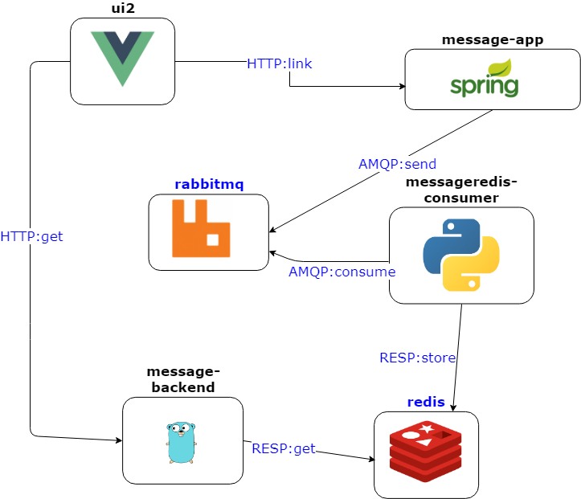

# Big Demo

A microservice demo project for evaluating google container tool [skaffold](https://github.com/GoogleContainerTools/skaffold). In order to check scalability ( especially in local environments) i wanted to go beyond the limits of an "hello world" project.

Here an overview of the components:



## Local environment

### Docker for windows

- We assume [Docker for Desktop](https://hub.docker.com/editions/community/docker-ce-desktop-windows) is running and you have [`kubectl`](https://kubernetes.io/docs/reference/kubectl/kubectl/) and [`jq`](https://stedolan.github.io/jq/) working.
- install helm: Download the binaries for windows and execute `helm install`
- install skaffold
- Run the build with `skaffold build`. If the images are not present, they must be pulled, this can take a while, so be patient.
- Deploy the helm chart with `skaffold deploy`. Like the step above the 3rd party images for redis and rabbitmq must be pulled, which can take a while. The redis might have some bootstrap problems with the master-slave connection, solve it with deleting the according pod.
- Default profile which is used in the step above is configured for the Docker for Desktop local kubernetes installation. E.g. the ingress and ingress-controller which routes the incoming http requests to the services is configured for localhost and no tls. You can check this with  `kubectl get svc bigdemo-nginx-ingress-controller` and `kubectl get ingress bigdemo-bigdemo -o json | jq .spec.rules`. Browse to `http://localhost` and you can see the bigdemo ui!
- Activate the deveopment cycle with `skaffold dev --port-forward=false`, we disable port-forwarding because we are using - as we have seen before - an ingress controller.

## Higher environments

### Google Kubernetes Engine (GKE)

#### create a k8s cluster

```bash
# setup cluster
export CLUSTER_NAME="bigdemo"
export CLUSTER_ZONE="europe-west1-d"

gcloud container clusters create $CLUSTER_NAME --zone=$CLUSTER_ZONE --cluster-version=latest --machine-type=n1-standard-4  --enable-autorepair --num-nodes=2

# create config file for kubectl to access cluster
gcloud container clusters get-credentials $CLUSTER_NAME --zone=$CLUSTER_ZONE

# helm setup
helm install
kubectl create serviceaccount --namespace kube-system tiller
kubectl create clusterrolebinding tiller-cluster-rule --clusterrole=cluster-admin --serviceaccount=kube-system:tiller
kubectl patch deploy --namespace kube-system tiller-deploy -p '{"spec":{"template":{"spec":{"serviceAccount":"tiller"}}}}'
```

#### build and deploy from a container

In order to simulate the CI/CD system which usually uses images for the runtime environment, you can mount the filesystem of the repository in a container with all the tools you need:
You need to create a file (`gke-env-file`) which contains your gcloud credentials. See [docs of skaffold for gke image](https://github.com/alitari/docker-skaffold-gcloud).

```bash
docker run -it -v $(pwd):/skaffold-project --env-file=gke-env-file alitari/docker-skaffold-gcloud:v2.0.0 bash
```

In the container you can now simulate the CI/CD process, which is fairly simple:

```bash
cd /skaffold-project
# define a prefix for the image tags
export RELEASE="1.0.0"
# build and deploy the app
skaffold deploy --profile gke
```
